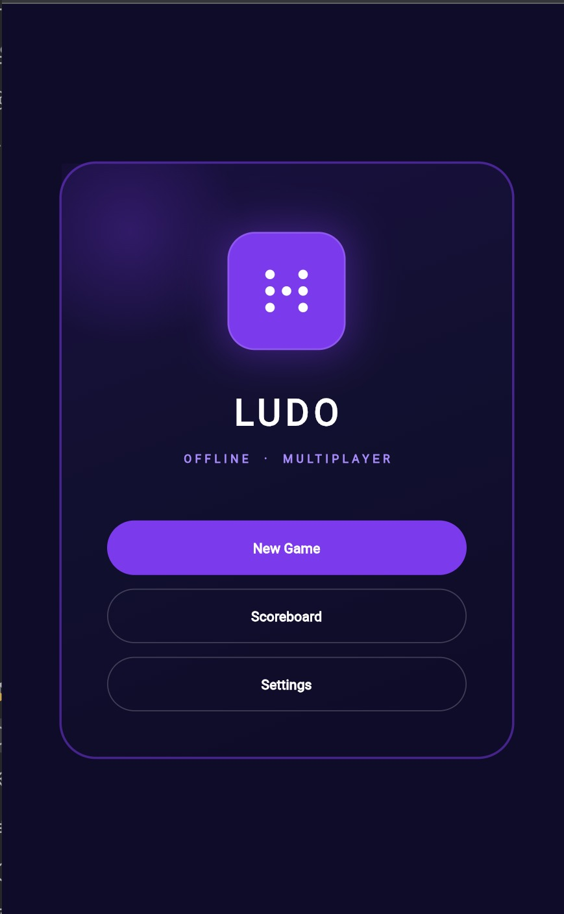
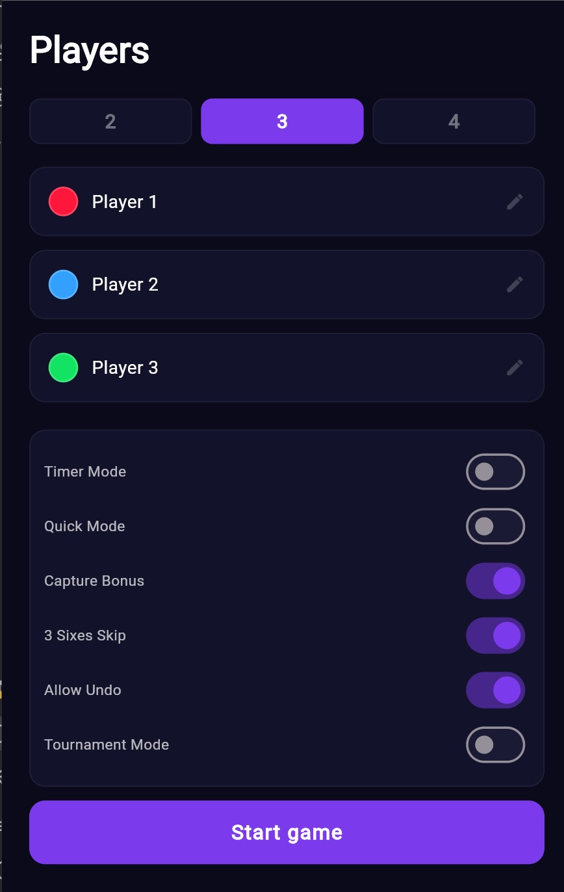
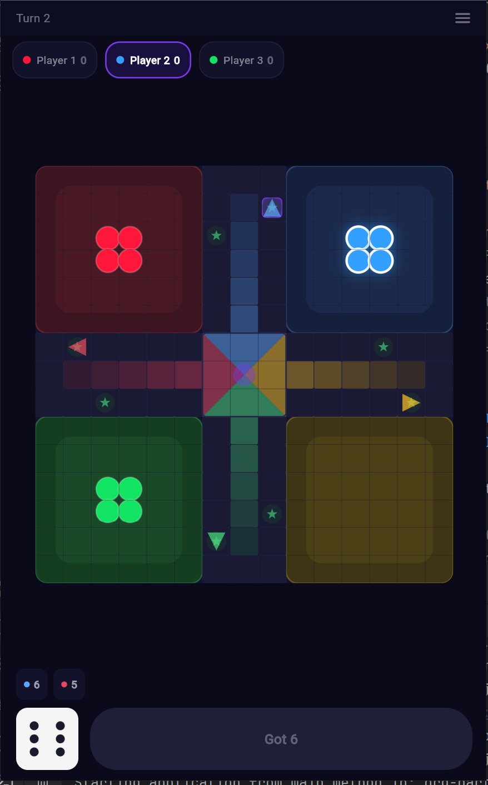
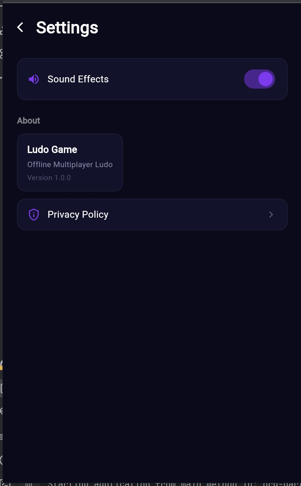

# AR Ludo Game

An offline multiplayer Ludo board game built with Flutter. Play with 2–4 players on the same device — no internet required. Features a dark purple UI theme, smooth animations, and a full tournament mode.

## Features

- **2–4 Player Offline Play** — Local multiplayer on a single device
- **Custom Player Names & Colors** — Personalize each player with unique names and token colors
- **Dark Purple Theme** — Sleek dark UI with glow effects and smooth animations
- **Tournament Mode** — Best of 3, 5, or 7 with standings and match history
- **Dice with 3D Animation** — Animated dice rolls with a history of the last 5 rolls
- **Undo Last Move** — Take back your last move if you change your mind
- **Timer Mode** — Optional turn timer (15s, 30s, 45s, 60s)
- **Token Capture Animation** — Visual feedback when a token lands on an opponent
- **Safe Zone Indicators** — Star markers on safe positions
- **Move Previews** — See where each token will land before moving
- **Haptic Feedback** — Vibration on dice roll, capture, and token movement
- **Splash Screen** — Animated loading screen with fade-in and progress bar
- **Privacy Policy & Settings** — In-app settings with sound toggle and privacy policy
- **Share Results** — Copy game results to clipboard

## 📸 Screenshots
<p align="center">
  
  
</br>
  
  
</p>

## Getting Started

### Prerequisites

- Flutter SDK `^3.11.5`
- Dart SDK `^3.11.5`
- Android Studio / VS Code
- Android SDK (API 21+) or Xcode for iOS

### Installation

```bash
# Clone the repository
git clone https://github.com/israinsols/ar_ludo-game.git

# Navigate to the project
cd ar_ludo-game

# Install dependencies
flutter pub get

# Run the app
flutter run
```

### Build APK

```bash
flutter build apk --release
```

## Project Structure

```
lib/
├── main.dart                    # App entry, routes, theme, providers
├── constants/
│   ├── board_data.dart          # Clockwise board path, home columns, safe positions
│   └── colors.dart              # Theme colors, player color mapping
├── models/
│   └── game_models.dart         # PlayerToken, Player, UndoSnapshot, GameSettings
├── providers/
│   ├── game_provider.dart       # Core game logic, dice, moves, captures, undo
│   ├── settings_provider.dart   # Sound toggle via SharedPreferences
│   └── tournament_provider.dart # Tournament state, standings, match history
├── screens/
│   ├── splash_screen.dart       # Animated splash with loading bar
│   ├── home_screen.dart         # Navigation hub
│   ├── player_setup_screen.dart # Player count, names, color picker, game options
│   ├── game_board_screen.dart   # Main game UI, board, dice, tokens
│   ├── win_screen.dart          # Trophy animation, tournament flow
│   ├── scoreboard_screen.dart   # Standings, match history
│   ├── settings_screen.dart     # Sound, privacy policy, about
│   ├── tournament_setup_screen.dart   # Tournament configuration
│   ├── tournament_dashboard_screen.dart # Match standings
│   ├── tournament_winner_screen.dart   # Champion celebration
│   └── privacy_policy_screen.dart      # Privacy policy
└── widgets/
    ├── dice_widget.dart         # Animated dice with 3D rotation
    └── ludo_board_painter.dart  # Canvas-painted board, base tokens, glow effects
```

## How It Works

### Game Rules
- Roll a **6** to move a token out of the base
- Move tokens **clockwise** around the board
- Land on an opponent's token to **capture** it back to their base
- **Safe zones** (marked with stars) protect tokens from capture
- Roll a **6** to get an **extra turn**
- First player to get all 4 tokens to the center wins

### Token Movement
- **Red** starts at position 42, exits at 41
- **Blue** starts at position 3, exits at 2
- **Green** starts at position 29, exits at 28
- **Yellow** starts at position 16, exits at 15
- Home columns are color-matched and lead to the center

### State Management
Uses **Provider** pattern with 3 providers:
- `GameProvider` — Game state, dice logic, token movement, captures, undo
- `SettingsProvider` — Sound settings persisted with SharedPreferences
- `TournamentProvider` — Tournament brackets, standings, match history

## Tech Stack

| Technology | Purpose |
|------------|---------|
| Flutter | Cross-platform UI framework |
| Dart | Programming language |
| Provider | State management |
| SharedPreferences | Local storage for settings |
| CustomPainter | Canvas-based board rendering |
| flutter_native_splash | Native splash screen |

## Platform Support

| Platform | Status |
|----------|--------|
| Android  | Supported |
| iOS      | Supported |
| Web      | Supported |
| Windows  | Supported |
| Linux    | Supported |
| macOS    | Supported |

## License

This project is proprietary. All rights reserved by ISRainsols.
